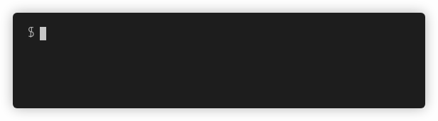

# Krateo

Cross platform commandline tool to manage Krateo Platform.

## Requirements

Before proceed to install Krateo, please verify our [requirements](./REQUIREMENTS.md).

# Installation

## Download and Install krateo cli

### MacOs

```sh
brew tap krateoplatformops/krateo
brew install krateo
```

or if you have already installed KRATEO using brew, you can upgrade KRATEO by running:

```sh
brew upgrade krateo
```

### From the [Binary Releases](https://github.com/krateoplatformops/krateo/releases) (macOS, Windows, Linux)

krateo currently provides pre-built binaries for the following:

- macOS (Darwin)
- Windows
- Linux

1. Download the appropriate version for your platform from [Krateo Releases](https://github.com/krateoplatformops/krateo/releases).

2. Once downloaded unpack the archive (zip for Windows; tarball for Linux and macOS) to extract the executable binary. 

3. If you want to use from any location you must put the binary executable in your `Path` or add the directory where is it to the environment variables.

### Using the [`Go`](https://go.dev/dl/) toolchain

```sh
go install github.com/krateoplatformops/krateo@latest
```

## tl;dr

```sh
krateo init
krateo install core
```

### Syntax

Most of the commands have flags; you can specify these:

- using the short notation (single dash and single letter; i.e.: `-v`)
- using the long notation (double dash and full flag name; i.e.: `--verbose`)
- by specifying environment variables
- from a config file located in `$HOME/.krateo/krateo.yaml`

## Initialize Krateo Platform

Usage: **`krateo init [flags]`** where:

| Flag               | Description                          |
| :----------------- | :----------------------------------- |
| `-v, --verbose`    | print verbose output                 |


Example:

```sh
$ krateo init
```



## Install Krateo Core with default configuration

Run this command to install the Krateo Core module with default configuration.

It downloads the default configuration from the Krateo Core Module repository and installs it in your kubernetes cluster.

Flags:

| Flag               | Required | Description                                         |
| :----------------- | :------- | :-------------------------------------------------- |
| `-v, --verbose`    | false    | print verbose output                                |
| `-r, --git-url`    | true     | git repository url for pushing module configuration |
| `-t, --git-token`  | true     | token for git repository authentication             |

to avoid having to specify these flags every time, you can define them in a file named `krateo.yaml` and located at `$HOME/.krateo` folder:

```yaml
git-url: YOUR_GIT_REPO_URL
git-token: YOUR_PERSONAL_ACCESS_TOKEN
```

```sh
$ krateo install core
```

## Install Krateo Core with custom configuration

```sh
$ krateo config core
```

When you run this command, you will be prompted to enter the configuration parameters.
It saves the config file to your specified git repository.

After you have successfully created the config file run

```sh
$ krateo install core
```


# Uninstall

```sh
$ krateo uninstall
```

# License

Do you want to buy a Silver License?
Follow this [guide](./LICENSE.md).

# Modules

Read more on module folder structure and other infos [here](./MODULES.md).
